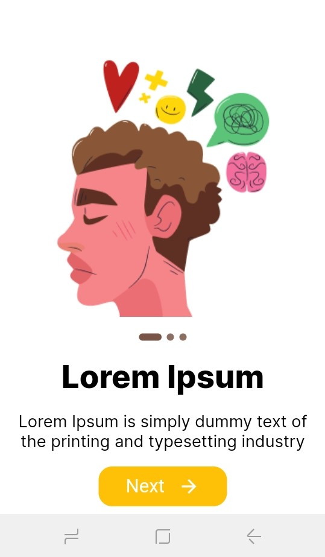
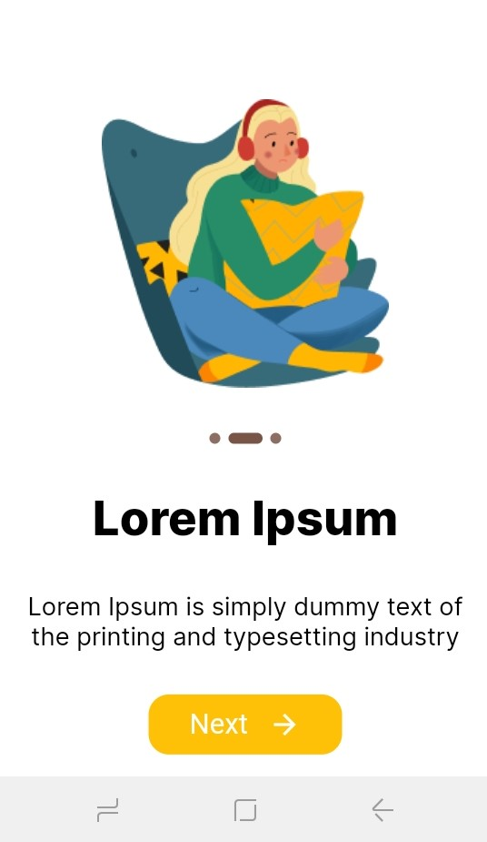
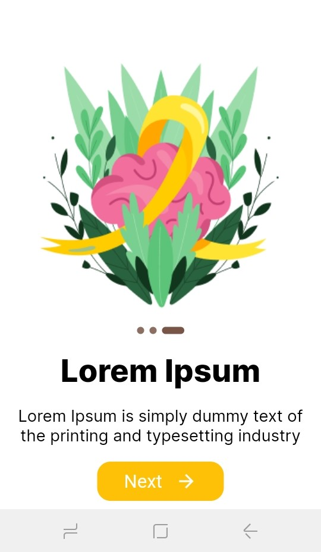

# Tela de Onboarding

### Criando o ambiente
Abra o terminal
```
mkdir telas_iniciais
cd telas_iniciais
```
### Criando um projeto
```
flutter create onboarding
```

### Abra o VS Code
```
code .
```
### Assets
Crie a pasta de assets na pasta raiz. Em seguida, adicione as imagens necessárias a esta pasta.

onboarding
    assets

Em seguida, abra o arquivo pubspec.yaml, descomente a pasta de assets e adicione o caminho das imagens

```
assets:
    - assets/


# Adicionando pacote
```

### Shared Preferences

Neste projeto, precisamos do pacote Shared Preferences. Porque a tela de integração aparece apenas uma vez. Usando o pacote de preferências compartilhadas, armazenamos as informações de integração no armazenamento local. Ele informa que o usuário viu a tela de integração ou não. Para obter a versão mais recente, visite a página oficial https://pub.dev/packages/shared_preferences.

Abra o arquivo pubspec.yaml e adicione o pacote Shared Preferences na seção de dependências.

```
dependencies:
  flutter:
    sdk: flutter


  # The following adds the Cupertino Icons font to your application.
  # Use with the CupertinoIcons class for iOS style icons.
  cupertino_icons: ^1.0.2
  shared_preferences: ^2.0.15

```
### Pasta de onboard
Abra a pasta lib e crie a pasta onboard
onboarding
    lib
       onboard

Dentro da pasta onboard crie dois arquivos dart	

onboard
  onboard.dart
  onboard_model.dart


### Google fonts
Instalando o pacote de fontes do Google no Flutter. O primeiro passo é carregar o pacote para fontes do google. Abra o arquivo pubspec.yaml e adicione o pacote de fontes do Google na seção de dependências. Para obter a versão mais recente, visite a página https://pub.dev/packages/google_fonts.

```
dependencies:
  flutter:
    sdk: flutter


  # The following adds the Cupertino Icons font to your application.
  # Use with the CupertinoIcons class for iOS style icons.
  cupertino_icons: ^1.0.2
  shared_preferences: ^2.0.15
  google_fonts: ^3.0.1

#Carregando o pacote Google fonts 
```

### Implementação
main.dart
```
import 'package:onboarding/home.dart';
import 'package:onboarding/onboard/onboard.dart';
import 'package:flutter/material.dart';
import 'package:flutter/services.dart';
import 'package:shared_preferences/shared_preferences.dart';

int? isviewed;
void main() async {
  SystemChrome.setSystemUIOverlayStyle(SystemUiOverlayStyle(
    statusBarColor: Colors.transparent,
  ));
  WidgetsFlutterBinding.ensureInitialized();
  SharedPreferences prefs = await SharedPreferences.getInstance();
  isviewed = prefs.getInt('onBoard');
  runApp(MyApp());
}

class MyApp extends StatefulWidget {
  @override
  _MyAppState createState() => _MyAppState();
}

class _MyAppState extends State<MyApp> {
  @override
  Widget build(BuildContext context) {
    return MaterialApp(
      debugShowCheckedModeBanner: false,
      title: 'Flutter Demo',
      theme: ThemeData(
        primarySwatch: Colors.blue,
      ),
      home: isviewed != 0 ? OnBoard() : Home(),
    );
  }
}

```

Dentro da pasta lib crie um arquivo dart
home.dart	
```
import 'package:flutter/material.dart';

class Home extends StatelessWidget {
  @override
  Widget build(BuildContext context) {
    return Scaffold(
      appBar: AppBar(
        title: Text("Home"),
      ),
    );
  }
}

```

Dentro da pasta lib crie um arquivo dart
constant.dart

```
import 'package:flutter/material.dart';

Color kwhite = Color(0xFFFFFFFF);
Color kblack = Color(0xFF000000);
Color kbrown300 = Color(0xFF8D6E63);
Color kbrown = Color(0xFF795548);
Color kgrey = Color(0xFFC0C0C0);
Color kamber = Color(0xFFFFC107);
Color kyshade = Color(0xFFFFF9C4);

const double defaultPadding = 16.0;

```
lib/onboard
onboard_model.dart

```
import 'package:flutter/cupertino.dart';

class OnboardModel {
  String img;
  String text;
  String desc;
  Color bg;
  Color button;

  OnboardModel({
    required this.img,
    required this.text,
    required this.desc,
    required this.bg,
    required this.button,
  });
}

```
 lib/onboard
onboard.dart

```
import 'package:onboarding/home.dart';
import 'package:onboarding/onboard/onboard_model.dart';
import 'package:flutter/material.dart';
import 'package:shared_preferences/shared_preferences.dart';
import '../constant.dart';
import 'package:google_fonts/google_fonts.dart';

class OnBoard extends StatefulWidget {
  @override
  _OnBoardState createState() => _OnBoardState();
}

class _OnBoardState extends State<OnBoard> {
  int currentIndex = 0;
  late PageController _pageController;
  List<OnboardModel> screens = <OnboardModel>[
    OnboardModel(
      img: 'assets/t1on.png',
      text: "Lorem Ipsum ",
      desc:
          "Lorem Ipsum is simply dummy text of the printing and typesetting industry",
      bg: Colors.white,
      button: Color(0xFFFFC107),
    ),
    OnboardModel(
      img: 'assets/t2on.png',
      text: "Lorem Ipsum ",
      desc:
          "Lorem Ipsum is simply dummy text of the printing and typesetting industry",
      bg: Colors.white,
      button: Color(0xFFFFC107),
    ),
    OnboardModel(
      img: 'assets/t3on.png',
      text: "Lorem Ipsum",
      desc:
          "Lorem Ipsum is simply dummy text of the printing and typesetting industry",
      bg: Colors.white,
      button: Color(0xFFFFC107),
    ),
  ];

  @override
  void initState() {
    _pageController = PageController(initialPage: 0);
    super.initState();
  }

  @override
  void dispose() {
    _pageController.dispose();
    super.dispose();
  }

  _storeOnboardInfo() async {
    print("Shared pref called");
    int isViewed = 0;
    SharedPreferences prefs = await SharedPreferences.getInstance();
    await prefs.setInt('onBoard', isViewed);
    print(prefs.getInt('onBoard'));
  }

  @override
  Widget build(BuildContext context) {
    return Scaffold(
      backgroundColor: kwhite,
      appBar: AppBar(
        backgroundColor: kwhite,
        elevation: 0.0,
      ),
      body: Padding(
        padding: const EdgeInsets.symmetric(horizontal: 20.0),
        child: PageView.builder(
            itemCount: screens.length,
            controller: _pageController,
            physics: NeverScrollableScrollPhysics(),
            onPageChanged: (int index) {
              setState(() {
                currentIndex = index;
              });
            },
            itemBuilder: (_, index) {
              return Column(
                mainAxisAlignment: MainAxisAlignment.spaceAround,
                crossAxisAlignment: CrossAxisAlignment.center,
                mainAxisSize: MainAxisSize.min,
                children: [
                  Image.asset(screens[index].img),
                  Container(
                    height: 10.0,
                    child: ListView.builder(
                      itemCount: screens.length,
                      shrinkWrap: true,
                      scrollDirection: Axis.horizontal,
                      itemBuilder: (context, index) {
                        return Row(
                            mainAxisAlignment: MainAxisAlignment.center,
                            children: [
                              Container(
                                //bolinhas
                                margin: EdgeInsets.symmetric(horizontal: 3.0),
                                width: currentIndex == index ? 25 : 8,
                                height: 8,
                                decoration: BoxDecoration(
                                  color: currentIndex == index
                                      ? kbrown
                                      : kbrown300,
                                  borderRadius: BorderRadius.circular(10.0),
                                ),
                              ),
                            ]);
                      },
                    ),
                  ),
                  Text(
                    //texto da tela
                    screens[index].text,
                    textAlign: TextAlign.center,
                    style: GoogleFonts.inter(
                      fontSize: 27.0,
                      fontWeight: FontWeight.w800,
                      color: kblack,
                    ),
                  ),
                  Text(
                    screens[index].desc,
                    textAlign: TextAlign.center,
                    style: GoogleFonts.inter(
                      fontSize: 14.0,
                      color: kblack,
                    ),
                  ),
                  InkWell(
                    //botao de proximo
                    onTap: () async {
                      print(index);
                      if (index == screens.length - 1) {
                        await _storeOnboardInfo();
                        Navigator.pushReplacement(context,
                            MaterialPageRoute(builder: (context) => Home()));
                      }

                      _pageController.nextPage(
                        duration: Duration(milliseconds: 300),
                        curve: Curves.bounceIn,
                      );
                    },
                    child: Container(
                      padding: const EdgeInsets.symmetric(
                          horizontal: 30.0, vertical: 10),
                      decoration: BoxDecoration(
                          color: kamber,
                          borderRadius: BorderRadius.circular(15.0)),
                      child: Row(mainAxisSize: MainAxisSize.min, children: [
                        Text(
                          "Next",
                          style: TextStyle(fontSize: 16.0, color: kwhite),
                        ),
                        SizedBox(
                          width: 15.0,
                        ),
                        Icon(
                          Icons.arrow_forward_sharp,
                          color: kwhite,
                        )
                      ]),
                    ),
                  )
                ],
              );
            }),
      ),
    );
  }
}

```

### Rodando o projeto
```
flutter run
```





